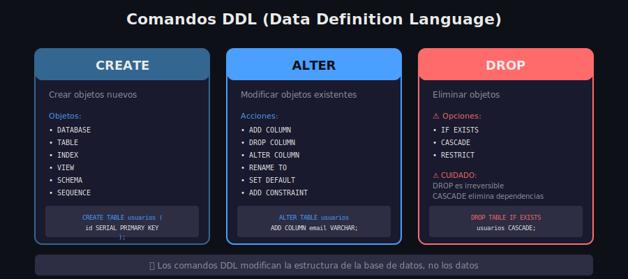

# 🏗️ Introducción a DDL

## 🎯 Objetivo

Comprender qué es DDL (Data Definition Language) y cuál es su rol en la gestión de bases de datos.

---

## 📖 ¿Qué es DDL?

**DDL (Data Definition Language)** es el subconjunto de SQL utilizado para **definir y modificar la estructura** de los objetos de una base de datos.

> 💡 **Diferencia clave**: DDL define la estructura (el "contenedor"), mientras que DML manipula los datos (el "contenido").

---

## 🔄 DDL vs DML

| Aspecto        | DDL                 | DML                    |
| -------------- | ------------------- | ---------------------- |
| **Propósito**  | Definir estructuras | Manipular datos        |
| **Comandos**   | CREATE, ALTER, DROP | INSERT, UPDATE, DELETE |
| **Afecta a**   | Esquema/Metadatos   | Filas de datos         |
| **Reversible** | No (sin backup)     | Sí (con ROLLBACK)      |
| **Frecuencia** | Ocasional           | Constante              |

---

## 📋 Comandos DDL Principales



### CREATE - Crear Objetos

```sql
-- Crear base de datos
CREATE DATABASE mi_app;

-- Crear esquema
CREATE SCHEMA ventas;

-- Crear tabla
CREATE TABLE productos (
    id SERIAL PRIMARY KEY,
    nombre VARCHAR(100) NOT NULL
);

-- Crear índice
CREATE INDEX idx_productos_nombre ON productos(nombre);

-- Crear vista
CREATE VIEW productos_activos AS
SELECT * FROM productos WHERE activo = TRUE;
```

### ALTER - Modificar Objetos

```sql
-- Añadir columna
ALTER TABLE productos ADD COLUMN precio DECIMAL(10,2);

-- Modificar tipo de columna
ALTER TABLE productos ALTER COLUMN nombre TYPE VARCHAR(200);

-- Renombrar tabla
ALTER TABLE productos RENAME TO catalogo;

-- Añadir restricción
ALTER TABLE productos ADD CONSTRAINT precio_positivo CHECK (precio > 0);
```

### DROP - Eliminar Objetos

```sql
-- Eliminar tabla (si existe)
DROP TABLE IF EXISTS productos;

-- Eliminar con dependencias
DROP TABLE productos CASCADE;

-- Eliminar base de datos
DROP DATABASE mi_app;

-- Eliminar índice
DROP INDEX idx_productos_nombre;
```

---

## 🏗️ Objetos que Puedes Crear

| Objeto       | Descripción                          | Comando           |
| ------------ | ------------------------------------ | ----------------- |
| **DATABASE** | Contenedor de esquemas y tablas      | `CREATE DATABASE` |
| **SCHEMA**   | Namespace para organizar objetos     | `CREATE SCHEMA`   |
| **TABLE**    | Almacena datos en filas/columnas     | `CREATE TABLE`    |
| **INDEX**    | Estructura para búsquedas rápidas    | `CREATE INDEX`    |
| **VIEW**     | Consulta guardada como tabla virtual | `CREATE VIEW`     |
| **SEQUENCE** | Generador de números secuenciales    | `CREATE SEQUENCE` |
| **TYPE**     | Tipo de dato personalizado           | `CREATE TYPE`     |
| **FUNCTION** | Función almacenada                   | `CREATE FUNCTION` |

---

## ⚠️ Consideraciones Importantes

### DDL es Auto-Commit

En PostgreSQL, los comandos DDL **se ejecutan inmediatamente** y no pueden revertirse con ROLLBACK en la mayoría de los casos.

```sql
-- ⚠️ Esto NO se puede deshacer fácilmente
DROP TABLE clientes;

-- ✅ Usa IF EXISTS para evitar errores
DROP TABLE IF EXISTS clientes;
```

### CASCADE vs RESTRICT

```sql
-- RESTRICT (por defecto): Falla si hay dependencias
DROP TABLE categorias RESTRICT;
-- ERROR: cannot drop table categorias because other objects depend on it

-- CASCADE: Elimina dependencias automáticamente
DROP TABLE categorias CASCADE;
-- NOTICE: drop cascades to constraint productos_categoria_id_fkey on table productos
```

---

## 🔒 Transacciones DDL en PostgreSQL

PostgreSQL es especial porque **soporta DDL transaccional**:

```sql
BEGIN;

CREATE TABLE nueva_tabla (id INT);
ALTER TABLE nueva_tabla ADD COLUMN nombre TEXT;

-- Si algo sale mal:
ROLLBACK;

-- Si todo está bien:
COMMIT;
```

> 💡 Esto es una ventaja sobre otros RDBMS como MySQL donde DDL hace commit implícito.

---

## 📝 Buenas Prácticas

### 1. Siempre usa IF EXISTS / IF NOT EXISTS

```sql
-- ✅ Evita errores si ya existe
CREATE TABLE IF NOT EXISTS usuarios (
    id SERIAL PRIMARY KEY
);

-- ✅ Evita errores si no existe
DROP TABLE IF EXISTS usuarios;
```

### 2. Nombra las restricciones explícitamente

```sql
-- ❌ Nombre autogenerado difícil de identificar
ALTER TABLE productos ADD CHECK (precio > 0);

-- ✅ Nombre descriptivo
ALTER TABLE productos ADD CONSTRAINT chk_precio_positivo CHECK (precio > 0);
```

### 3. Documenta los cambios

```sql
-- ============================================
-- Migración: Agregar campo email a usuarios
-- Fecha: 2025-12-08
-- Autor: Equipo desarrollo
-- ============================================
ALTER TABLE usuarios ADD COLUMN email VARCHAR(255);
```

### 4. Haz backup antes de DROP

```bash
# Antes de eliminar algo importante
pg_dump -U bootcamp -t tabla_importante tienda_online > backup_tabla.sql
```

---

## 🔍 Comandos Útiles para Inspección

```sql
-- Ver todas las tablas
\dt

-- Describir estructura de tabla
\d nombre_tabla

-- Ver definición completa de tabla
\d+ nombre_tabla

-- Ver todos los esquemas
\dn

-- Ver todas las bases de datos
\l

-- Ver índices de una tabla
\di
```

---

## ✅ Resumen

1. **DDL** define la estructura de la base de datos
2. **CREATE** crea objetos nuevos
3. **ALTER** modifica objetos existentes
4. **DROP** elimina objetos (¡con cuidado!)
5. PostgreSQL soporta **DDL transaccional**
6. Usa **IF EXISTS** para evitar errores
7. **Nombra las restricciones** explícitamente

---

## 📖 Navegación

|                             ⬅️ Semana 01                              |              Siguiente ➡️              |
| :-------------------------------------------------------------------: | :------------------------------------: |
| [Comandos Básicos](../../semana-01/2-practica/03-comandos-basicos.md) | [Tipos de Datos](02-tipos-de-datos.md) |
