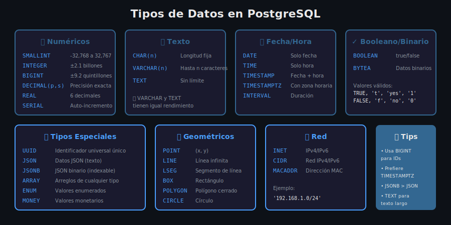

# 📊 Tipos de Datos en PostgreSQL

## 🎯 Objetivo

Conocer los tipos de datos disponibles en PostgreSQL y cuándo usar cada uno.

---

## 📖 Visión General

PostgreSQL ofrece una amplia variedad de tipos de datos, desde los estándar SQL hasta tipos especializados únicos.



---

## 🔢 Tipos Numéricos

### Enteros

| Tipo              | Tamaño  | Rango             | Uso                     |
| ----------------- | :-----: | ----------------- | ----------------------- |
| `SMALLINT`        | 2 bytes | -32,768 a 32,767  | Valores pequeños        |
| `INTEGER` / `INT` | 4 bytes | ±2.1 billones     | Uso general             |
| `BIGINT`          | 8 bytes | ±9.2 quintillones | IDs, contadores grandes |

```sql
CREATE TABLE ejemplo_enteros (
    contador_pequeno SMALLINT,
    cantidad INTEGER,
    id_unico BIGINT
);
```

### Auto-incremento (SERIAL)

| Tipo          | Equivale a           | Uso          |
| ------------- | -------------------- | ------------ |
| `SMALLSERIAL` | SMALLINT + secuencia | IDs pequeños |
| `SERIAL`      | INTEGER + secuencia  | IDs estándar |
| `BIGSERIAL`   | BIGINT + secuencia   | IDs grandes  |

```sql
-- SERIAL crea automáticamente una secuencia
CREATE TABLE usuarios (
    id SERIAL PRIMARY KEY,  -- Auto-incrementa: 1, 2, 3...
    nombre VARCHAR(100)
);

-- Equivalente moderno (PostgreSQL 10+)
CREATE TABLE usuarios (
    id INTEGER GENERATED ALWAYS AS IDENTITY PRIMARY KEY,
    nombre VARCHAR(100)
);
```

### Decimales

| Tipo                            | Precisión  | Uso                       |
| ------------------------------- | ---------- | ------------------------- |
| `DECIMAL(p,s)` / `NUMERIC(p,s)` | Exacta     | Dinero, cálculos precisos |
| `REAL`                          | 6 dígitos  | Cálculos científicos      |
| `DOUBLE PRECISION`              | 15 dígitos | Alta precisión flotante   |

```sql
CREATE TABLE productos (
    precio DECIMAL(10, 2),      -- Hasta 99,999,999.99
    peso REAL,                   -- 6 dígitos significativos
    coordenada DOUBLE PRECISION  -- 15 dígitos significativos
);
```

> ⚠️ **Importante**: Usa `DECIMAL` para dinero, nunca `REAL` o `DOUBLE PRECISION` (errores de redondeo).

---

## 📝 Tipos de Texto

| Tipo         | Descripción                          | Límite              |
| ------------ | ------------------------------------ | ------------------- |
| `CHAR(n)`    | Longitud fija (rellena con espacios) | n caracteres        |
| `VARCHAR(n)` | Longitud variable                    | Hasta n caracteres  |
| `TEXT`       | Longitud variable                    | Sin límite práctico |

```sql
CREATE TABLE clientes (
    codigo CHAR(10),           -- Siempre 10 caracteres
    nombre VARCHAR(100),       -- Hasta 100 caracteres
    biografia TEXT             -- Sin límite
);
```

### ¿Cuál usar?

| Situación                    | Recomendación |
| ---------------------------- | ------------- |
| Códigos fijos (país, moneda) | `CHAR(n)`     |
| Texto con límite conocido    | `VARCHAR(n)`  |
| Texto sin límite definido    | `TEXT`        |

> 💡 **En PostgreSQL**, `VARCHAR` sin límite y `TEXT` tienen el **mismo rendimiento**.

---

## 📅 Tipos de Fecha y Hora

| Tipo          | Almacena         | Ejemplo                |
| ------------- | ---------------- | ---------------------- |
| `DATE`        | Solo fecha       | 2025-12-08             |
| `TIME`        | Solo hora        | 14:30:00               |
| `TIMESTAMP`   | Fecha + hora     | 2025-12-08 14:30:00    |
| `TIMESTAMPTZ` | Con zona horaria | 2025-12-08 14:30:00+01 |
| `INTERVAL`    | Duración         | 1 year 2 months 3 days |

```sql
CREATE TABLE eventos (
    fecha_evento DATE,
    hora_inicio TIME,
    created_at TIMESTAMP DEFAULT CURRENT_TIMESTAMP,
    updated_at TIMESTAMPTZ DEFAULT NOW()
);

-- Ejemplos de INTERVAL
SELECT NOW() + INTERVAL '1 day';
SELECT NOW() - INTERVAL '2 hours 30 minutes';
```

> 💡 **Recomendación**: Usa siempre `TIMESTAMPTZ` para evitar problemas con zonas horarias.

---

## ✓ Tipo Booleano

| Tipo      | Valores           |
| --------- | ----------------- |
| `BOOLEAN` | TRUE, FALSE, NULL |

```sql
CREATE TABLE tareas (
    id SERIAL PRIMARY KEY,
    titulo VARCHAR(200),
    completada BOOLEAN DEFAULT FALSE
);

-- Valores aceptados para TRUE
INSERT INTO tareas (titulo, completada) VALUES ('Tarea 1', TRUE);
INSERT INTO tareas (titulo, completada) VALUES ('Tarea 2', 't');
INSERT INTO tareas (titulo, completada) VALUES ('Tarea 3', 'yes');
INSERT INTO tareas (titulo, completada) VALUES ('Tarea 4', '1');
```

---

## ⭐ Tipos Especiales

### UUID

Identificador universalmente único (128 bits).

```sql
-- Habilitar extensión
CREATE EXTENSION IF NOT EXISTS "uuid-ossp";

CREATE TABLE sesiones (
    id UUID DEFAULT uuid_generate_v4() PRIMARY KEY,
    usuario_id INTEGER,
    created_at TIMESTAMP DEFAULT NOW()
);
```

### JSON y JSONB

| Tipo    | Descripción  | Uso                   |
| ------- | ------------ | --------------------- |
| `JSON`  | Texto JSON   | Almacenamiento simple |
| `JSONB` | JSON binario | Consultas, índices    |

```sql
CREATE TABLE configuraciones (
    id SERIAL PRIMARY KEY,
    datos JSON,           -- Almacena como texto
    metadata JSONB        -- Binario, indexable
);

INSERT INTO configuraciones (datos, metadata) VALUES (
    '{"tema": "oscuro", "idioma": "es"}',
    '{"version": 1, "features": ["a", "b"]}'
);

-- Consultar JSONB
SELECT * FROM configuraciones WHERE metadata->>'version' = '1';
SELECT * FROM configuraciones WHERE metadata @> '{"features": ["a"]}';
```

> 💡 **Usa JSONB** casi siempre: es más rápido para consultas y soporta índices.

### ARRAY

Arreglos de cualquier tipo.

```sql
CREATE TABLE productos (
    id SERIAL PRIMARY KEY,
    nombre VARCHAR(100),
    tags TEXT[],
    precios_historicos DECIMAL(10,2)[]
);

INSERT INTO productos (nombre, tags, precios_historicos) VALUES (
    'Laptop',
    ARRAY['electrónica', 'computadoras', 'portátil'],
    ARRAY[999.99, 899.99, 1099.99]
);

-- Consultar arrays
SELECT * FROM productos WHERE 'electrónica' = ANY(tags);
SELECT * FROM productos WHERE tags @> ARRAY['portátil'];
```

### ENUM

Valores predefinidos.

```sql
CREATE TYPE estado_pedido AS ENUM ('pendiente', 'procesando', 'enviado', 'entregado', 'cancelado');

CREATE TABLE pedidos (
    id SERIAL PRIMARY KEY,
    estado estado_pedido DEFAULT 'pendiente'
);

INSERT INTO pedidos (estado) VALUES ('procesando');
-- INSERT INTO pedidos (estado) VALUES ('invalido');  -- ERROR
```

---

## 🌐 Tipos de Red

```sql
CREATE TABLE logs_acceso (
    id SERIAL PRIMARY KEY,
    ip_cliente INET,
    red_origen CIDR,
    mac_dispositivo MACADDR
);

INSERT INTO logs_acceso (ip_cliente, red_origen) VALUES (
    '192.168.1.100',
    '192.168.1.0/24'
);

-- Consultas de red
SELECT * FROM logs_acceso WHERE ip_cliente << '192.168.0.0/16';
```

---

## 📍 Tipos Geométricos

```sql
CREATE TABLE ubicaciones (
    id SERIAL PRIMARY KEY,
    nombre VARCHAR(100),
    punto POINT,
    area BOX
);

INSERT INTO ubicaciones (nombre, punto, area) VALUES (
    'Oficina Central',
    POINT(40.4168, -3.7038),  -- lat, lon
    BOX(POINT(0,0), POINT(100,100))
);
```

> 💡 Para aplicaciones GIS reales, usa la extensión **PostGIS**.

---

## 💰 Tipo MONEY

```sql
CREATE TABLE facturas (
    id SERIAL PRIMARY KEY,
    total MONEY
);

INSERT INTO facturas (total) VALUES ('$1,234.56');
SELECT total::NUMERIC FROM facturas;  -- Convertir a número
```

> ⚠️ **Advertencia**: `MONEY` depende de la configuración regional. Prefiere `DECIMAL(10,2)` para mayor control.

---

## 📋 Guía de Selección de Tipos

| Dato                    | Tipo Recomendado       |
| ----------------------- | ---------------------- |
| ID autoincremental      | `SERIAL` o `BIGSERIAL` |
| ID universal            | `UUID`                 |
| Dinero/Precios          | `DECIMAL(10,2)`        |
| Texto corto conocido    | `VARCHAR(n)`           |
| Texto largo             | `TEXT`                 |
| Fecha/Hora              | `TIMESTAMPTZ`          |
| Sí/No                   | `BOOLEAN`              |
| Datos semiestructurados | `JSONB`                |
| Lista de valores        | `ARRAY` o `ENUM`       |
| Dirección IP            | `INET`                 |

---

## ✅ Resumen

1. **Enteros**: SMALLINT, INTEGER, BIGINT según el rango
2. **Decimales**: DECIMAL para dinero, REAL/DOUBLE para científicos
3. **Texto**: VARCHAR para límites conocidos, TEXT para ilimitado
4. **Fecha/Hora**: Prefiere TIMESTAMPTZ
5. **Especiales**: UUID, JSONB, ARRAY son muy útiles
6. **Elige el tipo más específico** para tu caso de uso

---

## 📖 Navegación

|                ⬅️ Anterior                 |           Siguiente ➡️           |
| :----------------------------------------: | :------------------------------: |
| [Introducción DDL](01-introduccion-ddl.md) | [Constraints](03-constraints.md) |
