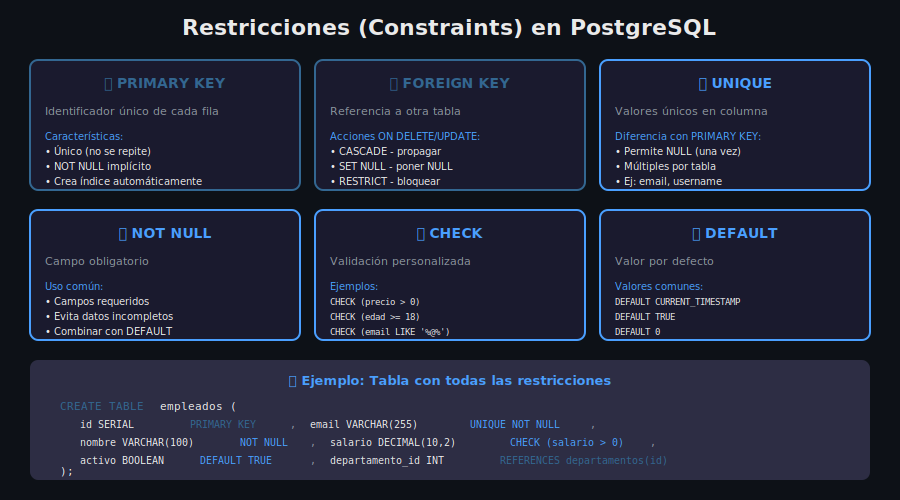

# 🔒 Restricciones (Constraints)

## 🎯 Objetivo

Aprender a usar restricciones para garantizar la integridad y validez de los datos.

---

## 📖 ¿Qué son las Constraints?

Las **restricciones (constraints)** son reglas que se aplican a las columnas para garantizar la integridad de los datos. PostgreSQL rechazará cualquier dato que viole estas reglas.



---

## 🔑 PRIMARY KEY

Identifica de forma **única** cada fila de la tabla.

### Características

- ✅ Valores únicos (no se repiten)
- ✅ NOT NULL implícito
- ✅ Solo una por tabla
- ✅ Crea índice automáticamente

### Sintaxis

```sql
-- En la definición de columna
CREATE TABLE usuarios (
    id SERIAL PRIMARY KEY,
    nombre VARCHAR(100)
);

-- Como restricción de tabla (permite múltiples columnas)
CREATE TABLE pedidos_detalle (
    pedido_id INTEGER,
    producto_id INTEGER,
    cantidad INTEGER,
    PRIMARY KEY (pedido_id, producto_id)  -- Clave compuesta
);

-- Nombrada explícitamente
CREATE TABLE clientes (
    id SERIAL,
    email VARCHAR(255),
    CONSTRAINT pk_clientes PRIMARY KEY (id)
);
```

---

## 🔗 FOREIGN KEY

Crea una **relación** entre dos tablas, asegurando que el valor existe en la tabla referenciada.

### Sintaxis Básica

```sql
CREATE TABLE categorias (
    id SERIAL PRIMARY KEY,
    nombre VARCHAR(100)
);

CREATE TABLE productos (
    id SERIAL PRIMARY KEY,
    nombre VARCHAR(100),
    categoria_id INTEGER REFERENCES categorias(id)
);
```

### Acciones Referenciales

Define qué hacer cuando se elimina o actualiza la fila referenciada.

| Acción        | Descripción                                |
| ------------- | ------------------------------------------ |
| `CASCADE`     | Propaga la acción a las filas dependientes |
| `SET NULL`    | Establece NULL en la columna FK            |
| `SET DEFAULT` | Establece el valor DEFAULT                 |
| `RESTRICT`    | Bloquea la acción (error)                  |
| `NO ACTION`   | Similar a RESTRICT (por defecto)           |

```sql
CREATE TABLE pedidos (
    id SERIAL PRIMARY KEY,
    cliente_id INTEGER,
    CONSTRAINT fk_cliente
        FOREIGN KEY (cliente_id)
        REFERENCES clientes(id)
        ON DELETE SET NULL      -- Si se elimina el cliente, poner NULL
        ON UPDATE CASCADE       -- Si cambia el ID del cliente, actualizar
);
```

### Ejemplo Práctico

```sql
-- Tabla padre
CREATE TABLE departamentos (
    id SERIAL PRIMARY KEY,
    nombre VARCHAR(100) NOT NULL
);

-- Tabla hija con FK
CREATE TABLE empleados (
    id SERIAL PRIMARY KEY,
    nombre VARCHAR(100) NOT NULL,
    departamento_id INTEGER NOT NULL,
    CONSTRAINT fk_departamento
        FOREIGN KEY (departamento_id)
        REFERENCES departamentos(id)
        ON DELETE RESTRICT  -- No permitir eliminar departamento con empleados
);

-- Intentar eliminar departamento con empleados fallará
DELETE FROM departamentos WHERE id = 1;
-- ERROR: update or delete on table "departamentos" violates foreign key constraint
```

---

## ✨ UNIQUE

Garantiza que los valores de una columna (o combinación) sean **únicos**.

### Diferencias con PRIMARY KEY

| Aspecto            | PRIMARY KEY             | UNIQUE                     |
| ------------------ | ----------------------- | -------------------------- |
| Cantidad por tabla | Solo 1                  | Múltiples                  |
| Permite NULL       | No                      | Sí (una vez)               |
| Propósito          | Identificador principal | Valores únicos secundarios |

### Sintaxis

```sql
-- En columna
CREATE TABLE usuarios (
    id SERIAL PRIMARY KEY,
    email VARCHAR(255) UNIQUE,
    username VARCHAR(50) UNIQUE
);

-- Como restricción de tabla (único compuesto)
CREATE TABLE inscripciones (
    id SERIAL PRIMARY KEY,
    estudiante_id INTEGER,
    curso_id INTEGER,
    UNIQUE (estudiante_id, curso_id)  -- Un estudiante solo puede inscribirse una vez por curso
);

-- Nombrada
CREATE TABLE productos (
    id SERIAL PRIMARY KEY,
    sku VARCHAR(50),
    CONSTRAINT uq_productos_sku UNIQUE (sku)
);
```

---

## ❗ NOT NULL

Obliga a que la columna **siempre tenga un valor**.

```sql
CREATE TABLE clientes (
    id SERIAL PRIMARY KEY,
    nombre VARCHAR(100) NOT NULL,      -- Obligatorio
    email VARCHAR(255) NOT NULL,       -- Obligatorio
    telefono VARCHAR(20)               -- Opcional (puede ser NULL)
);

-- Esto fallará:
INSERT INTO clientes (nombre) VALUES ('Juan');
-- ERROR: null value in column "email" violates not-null constraint
```

### NOT NULL con DEFAULT

```sql
CREATE TABLE productos (
    id SERIAL PRIMARY KEY,
    nombre VARCHAR(100) NOT NULL,
    activo BOOLEAN NOT NULL DEFAULT TRUE,  -- Si no se especifica, será TRUE
    stock INTEGER NOT NULL DEFAULT 0
);

-- Esto funciona (usa los defaults):
INSERT INTO productos (nombre) VALUES ('Laptop');
-- activo = TRUE, stock = 0
```

---

## ✅ CHECK

Valida que los datos cumplan una **condición personalizada**.

### Sintaxis

```sql
CREATE TABLE productos (
    id SERIAL PRIMARY KEY,
    nombre VARCHAR(100) NOT NULL,
    precio DECIMAL(10,2) CHECK (precio > 0),
    stock INTEGER CHECK (stock >= 0),
    descuento INTEGER CHECK (descuento BETWEEN 0 AND 100)
);

-- Con nombre
CREATE TABLE empleados (
    id SERIAL PRIMARY KEY,
    edad INTEGER,
    salario DECIMAL(10,2),
    CONSTRAINT chk_edad_valida CHECK (edad >= 18 AND edad <= 120),
    CONSTRAINT chk_salario_positivo CHECK (salario > 0)
);
```

### Ejemplos de CHECK Útiles

```sql
-- Validar email básico
CHECK (email LIKE '%@%.%')

-- Validar longitud mínima
CHECK (LENGTH(password) >= 8)

-- Validar valores permitidos
CHECK (estado IN ('activo', 'inactivo', 'pendiente'))

-- Validar fechas
CHECK (fecha_fin > fecha_inicio)

-- Validar entre columnas
CREATE TABLE eventos (
    id SERIAL PRIMARY KEY,
    fecha_inicio DATE NOT NULL,
    fecha_fin DATE NOT NULL,
    CONSTRAINT chk_fechas_validas CHECK (fecha_fin >= fecha_inicio)
);
```

---

## 📋 DEFAULT

Establece un **valor por defecto** cuando no se proporciona uno.

```sql
CREATE TABLE articulos (
    id SERIAL PRIMARY KEY,
    titulo VARCHAR(200) NOT NULL,
    contenido TEXT,
    publicado BOOLEAN DEFAULT FALSE,
    vistas INTEGER DEFAULT 0,
    created_at TIMESTAMP DEFAULT CURRENT_TIMESTAMP,
    updated_at TIMESTAMP DEFAULT NOW()
);

-- Insertar sin especificar defaults
INSERT INTO articulos (titulo, contenido) VALUES ('Mi artículo', 'Contenido...');
-- publicado = FALSE, vistas = 0, created_at = ahora
```

### Valores DEFAULT Comunes

| Expresión                     | Uso                 |
| ----------------------------- | ------------------- |
| `CURRENT_TIMESTAMP` / `NOW()` | Fecha y hora actual |
| `CURRENT_DATE`                | Fecha actual        |
| `TRUE` / `FALSE`              | Booleanos           |
| `0`                           | Contadores          |
| `uuid_generate_v4()`          | UUID aleatorio      |
| `''`                          | Cadena vacía        |

---

## 🛠️ Agregar y Eliminar Constraints

### Agregar a Tabla Existente

```sql
-- Agregar NOT NULL
ALTER TABLE productos ALTER COLUMN nombre SET NOT NULL;

-- Agregar CHECK
ALTER TABLE productos ADD CONSTRAINT chk_precio CHECK (precio > 0);

-- Agregar UNIQUE
ALTER TABLE usuarios ADD CONSTRAINT uq_email UNIQUE (email);

-- Agregar FOREIGN KEY
ALTER TABLE pedidos ADD CONSTRAINT fk_cliente
    FOREIGN KEY (cliente_id) REFERENCES clientes(id);

-- Agregar PRIMARY KEY
ALTER TABLE logs ADD CONSTRAINT pk_logs PRIMARY KEY (id);
```

### Eliminar Constraints

```sql
-- Eliminar por nombre
ALTER TABLE productos DROP CONSTRAINT chk_precio;

-- Eliminar NOT NULL
ALTER TABLE productos ALTER COLUMN nombre DROP NOT NULL;

-- Eliminar PRIMARY KEY (primero elimina FK que dependan de ella)
ALTER TABLE productos DROP CONSTRAINT productos_pkey;
```

---

## 📝 Nombrado de Constraints

### Convención Recomendada

| Tipo        | Prefijo | Ejemplo               |
| ----------- | ------- | --------------------- |
| Primary Key | `pk_`   | `pk_usuarios`         |
| Foreign Key | `fk_`   | `fk_pedidos_cliente`  |
| Unique      | `uq_`   | `uq_usuarios_email`   |
| Check       | `chk_`  | `chk_precio_positivo` |

```sql
CREATE TABLE pedidos (
    id SERIAL,
    cliente_id INTEGER NOT NULL,
    total DECIMAL(10,2),
    estado VARCHAR(20),

    CONSTRAINT pk_pedidos PRIMARY KEY (id),
    CONSTRAINT fk_pedidos_cliente FOREIGN KEY (cliente_id) REFERENCES clientes(id),
    CONSTRAINT chk_pedidos_total CHECK (total >= 0),
    CONSTRAINT chk_pedidos_estado CHECK (estado IN ('pendiente', 'pagado', 'enviado'))
);
```

---

## 🔍 Ver Constraints de una Tabla

```sql
-- Ver estructura completa (incluye constraints)
\d+ nombre_tabla

-- Consultar catálogo del sistema
SELECT
    conname AS constraint_name,
    contype AS constraint_type,
    pg_get_constraintdef(oid) AS definition
FROM pg_constraint
WHERE conrelid = 'productos'::regclass;
```

---

## ✅ Resumen

| Constraint  | Propósito                | Múltiples | NULL |
| ----------- | ------------------------ | :-------: | :--: |
| PRIMARY KEY | Identificador único      |    No     |  No  |
| FOREIGN KEY | Relación entre tablas    |    Sí     |  Sí  |
| UNIQUE      | Valores únicos           |    Sí     | Sí\* |
| NOT NULL    | Valor obligatorio        |    Sí     |  No  |
| CHECK       | Validación personalizada |    Sí     |  Sí  |
| DEFAULT     | Valor por defecto        |    Sí     |  -   |

\*UNIQUE permite un solo NULL

---

## 📖 Navegación

|              ⬅️ Anterior               |      🏠 Semana 02      |                        Siguiente ➡️                         |
| :------------------------------------: | :--------------------: | :---------------------------------------------------------: |
| [Tipos de Datos](02-tipos-de-datos.md) | [README](../README.md) | [Práctica: Crear BD](../2-practica/01-crear-bases-datos.md) |
