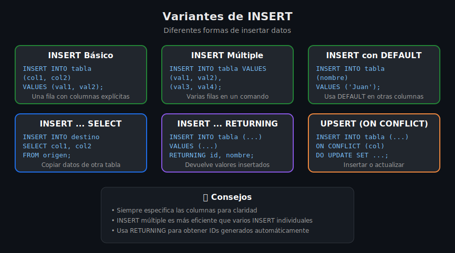

# ➕ INSERT - Insertar Datos

## 🎯 Objetivo

Dominar todas las formas de insertar datos en PostgreSQL.

---

## 📖 Sintaxis Básica

```sql
INSERT INTO nombre_tabla (columna1, columna2, ...)
VALUES (valor1, valor2, ...);
```

---

## 📋 Formas de INSERT



---

## 1️⃣ INSERT Simple

### Con todas las columnas

```sql
-- Especificando todas las columnas
INSERT INTO productos (id, nombre, precio, stock, activo)
VALUES (1, 'Laptop HP', 899.99, 50, TRUE);
```

**¿Qué?** Inserta una fila especificando cada columna.

**¿Para qué?** Claridad y control total sobre qué se inserta.

**Impacto:** Una fila agregada a la tabla.

---

### Omitiendo columnas con DEFAULT

```sql
-- Omitir columnas que tienen DEFAULT o permiten NULL
INSERT INTO productos (nombre, precio)
VALUES ('Mouse Logitech', 29.99);
-- id = SERIAL (auto), stock = DEFAULT, activo = DEFAULT
```

**¿Qué?** Inserta solo las columnas especificadas.

**¿Para qué?** Usar valores DEFAULT automáticamente.

**Impacto:** Las columnas omitidas usan su DEFAULT o NULL.

---

### Sin especificar columnas (no recomendado)

```sql
-- ⚠️ No recomendado: depende del orden de columnas
INSERT INTO productos
VALUES (2, 'Teclado', 'Mecánico RGB', 79.99, 100, TRUE, NOW());
```

> ⚠️ **Evitar**: Si cambias la estructura de la tabla, el INSERT falla o inserta datos en columnas incorrectas.

---

## 2️⃣ INSERT Múltiple

Insertar varias filas en un solo comando:

```sql
INSERT INTO productos (nombre, precio, stock) VALUES
    ('Monitor 24"', 199.99, 30),
    ('Webcam HD', 49.99, 100),
    ('Auriculares', 79.99, 75),
    ('Hub USB', 24.99, 200);
```

**¿Qué?** Inserta múltiples filas en una operación.

**¿Para qué?** Mejor rendimiento que múltiples INSERT individuales.

**Impacto:** Más eficiente en red y transacciones.

### Comparación de rendimiento

```sql
-- ❌ Lento: 1000 operaciones
INSERT INTO t VALUES (1);
INSERT INTO t VALUES (2);
-- ... 998 más

-- ✅ Rápido: 1 operación
INSERT INTO t VALUES (1), (2), (3), ... (1000);
```

---

## 3️⃣ INSERT con DEFAULT

### Usar DEFAULT explícitamente

```sql
INSERT INTO productos (nombre, precio, stock, created_at)
VALUES ('Producto Test', 9.99, DEFAULT, DEFAULT);
```

### Insertar solo DEFAULTs

```sql
-- Inserta una fila con todos los valores DEFAULT
INSERT INTO auditoria DEFAULT VALUES;
```

---

## 4️⃣ INSERT ... SELECT

Copiar datos desde otra tabla o consulta:

```sql
-- Copiar productos activos a histórico
INSERT INTO productos_historico (producto_id, nombre, precio, fecha)
SELECT id, nombre, precio, NOW()
FROM productos
WHERE activo = TRUE;
```

**¿Qué?** Inserta filas basándose en una consulta SELECT.

**¿Para qué?**

- Copiar datos entre tablas
- Transformar datos al insertar
- Poblar tablas de respaldo/histórico

**Impacto:** Puede insertar muchas filas de una vez.

### Ejemplos prácticos

```sql
-- Crear tabla de backup con datos
INSERT INTO clientes_backup
SELECT * FROM clientes WHERE created_at < '2024-01-01';

-- Insertar con transformación
INSERT INTO ventas_resumen (mes, total_ventas)
SELECT
    DATE_TRUNC('month', fecha) AS mes,
    SUM(total) AS total_ventas
FROM ventas
GROUP BY DATE_TRUNC('month', fecha);

-- Insertar de una unión
INSERT INTO todos_usuarios (nombre, email, origen)
SELECT nombre, email, 'web' FROM usuarios_web
UNION ALL
SELECT nombre, email, 'app' FROM usuarios_app;
```

---

## 5️⃣ INSERT ... RETURNING

Obtener los valores insertados (especialmente útil para IDs auto-generados):

```sql
-- Obtener el ID generado
INSERT INTO productos (nombre, precio)
VALUES ('Nuevo Producto', 99.99)
RETURNING id;
-- Devuelve: id = 15 (por ejemplo)

-- Obtener múltiples columnas
INSERT INTO productos (nombre, precio)
VALUES ('Otro Producto', 149.99)
RETURNING id, nombre, created_at;

-- Obtener todo
INSERT INTO productos (nombre, precio)
VALUES ('Tercer Producto', 199.99)
RETURNING *;
```

**¿Qué?** Devuelve los valores de las filas insertadas.

**¿Para qué?** Obtener IDs generados, timestamps, etc., sin hacer otro SELECT.

**Impacto:** Evita consultas adicionales.

---

## 6️⃣ UPSERT (INSERT ... ON CONFLICT)

Insertar o actualizar si ya existe (PostgreSQL 9.5+):

### ON CONFLICT DO NOTHING

```sql
-- Si el email ya existe, no hacer nada
INSERT INTO usuarios (email, nombre)
VALUES ('juan@email.com', 'Juan')
ON CONFLICT (email) DO NOTHING;
```

### ON CONFLICT DO UPDATE

```sql
-- Si el SKU ya existe, actualizar precio y stock
INSERT INTO productos (sku, nombre, precio, stock)
VALUES ('PROD-001', 'Laptop', 999.99, 50)
ON CONFLICT (sku) DO UPDATE SET
    precio = EXCLUDED.precio,
    stock = EXCLUDED.stock,
    updated_at = NOW();
```

**¿Qué?** Maneja el conflicto de clave única.

**¿Para qué?**

- Sincronizar datos de fuentes externas
- Actualizar si existe, insertar si no
- Evitar errores de duplicado

**Impacto:** Una operación atómica para insert/update.

### EXCLUDED

`EXCLUDED` hace referencia a los valores que se intentaban insertar:

```sql
INSERT INTO inventario (producto_id, cantidad)
VALUES (5, 100)
ON CONFLICT (producto_id) DO UPDATE SET
    cantidad = inventario.cantidad + EXCLUDED.cantidad;
    -- inventario.cantidad = valor actual
    -- EXCLUDED.cantidad = valor nuevo (100)
```

---

## 📊 Tipos de Datos en INSERT

### Texto

```sql
INSERT INTO t (columna) VALUES ('texto con comillas simples');
INSERT INTO t (columna) VALUES ('texto con ''comilla'' escapada');
INSERT INTO t (columna) VALUES (E'texto con\nnueva línea');
```

### Números

```sql
INSERT INTO t (entero, decimal) VALUES (42, 3.14159);
INSERT INTO t (precio) VALUES (99.99);
```

### Fechas

```sql
INSERT INTO t (fecha) VALUES ('2025-12-08');
INSERT INTO t (fecha) VALUES (CURRENT_DATE);
INSERT INTO t (timestamp) VALUES (NOW());
INSERT INTO t (timestamp) VALUES ('2025-12-08 14:30:00');
```

### Booleanos

```sql
INSERT INTO t (activo) VALUES (TRUE);
INSERT INTO t (activo) VALUES (FALSE);
INSERT INTO t (activo) VALUES ('yes');  -- También válido
INSERT INTO t (activo) VALUES ('no');
```

### Arrays

```sql
INSERT INTO t (tags) VALUES (ARRAY['tag1', 'tag2', 'tag3']);
INSERT INTO t (tags) VALUES ('{"tag1", "tag2"}');
```

### JSON

```sql
INSERT INTO t (datos) VALUES ('{"nombre": "Juan", "edad": 30}');
INSERT INTO t (datos) VALUES ('{"items": [1, 2, 3]}');
```

### NULL

```sql
INSERT INTO t (opcional) VALUES (NULL);
```

---

## ✅ Buenas Prácticas

### 1. Siempre especifica las columnas

```sql
-- ✅ Bueno
INSERT INTO productos (nombre, precio) VALUES ('Test', 9.99);

-- ❌ Malo (frágil ante cambios de estructura)
INSERT INTO productos VALUES (1, 'Test', 9.99, ...);
```

### 2. Usa INSERT múltiple para muchas filas

```sql
-- ✅ Eficiente
INSERT INTO t (col) VALUES (1), (2), (3), (4), (5);
```

### 3. Usa RETURNING para obtener IDs

```sql
-- ✅ Una sola operación
INSERT INTO t (nombre) VALUES ('X') RETURNING id;

-- ❌ Dos operaciones
INSERT INTO t (nombre) VALUES ('X');
SELECT currval('t_id_seq');
```

### 4. Usa ON CONFLICT para upserts

```sql
-- ✅ Atómico y claro
INSERT INTO t (key, value) VALUES ('k', 'v')
ON CONFLICT (key) DO UPDATE SET value = EXCLUDED.value;
```

---

## ✅ Resumen

| Forma                  | Uso                              |
| ---------------------- | -------------------------------- |
| INSERT simple          | Una fila con columnas explícitas |
| INSERT múltiple        | Varias filas, mejor rendimiento  |
| INSERT ... SELECT      | Copiar datos de otra consulta    |
| INSERT ... RETURNING   | Obtener valores insertados       |
| INSERT ... ON CONFLICT | Upsert (insertar o actualizar)   |

---

## 📖 Navegación

|                ⬅️ Anterior                 |              Siguiente ➡️              |
| :----------------------------------------: | :------------------------------------: |
| [Introducción DML](01-introduccion-dml.md) | [UPDATE y DELETE](03-update-delete.md) |
