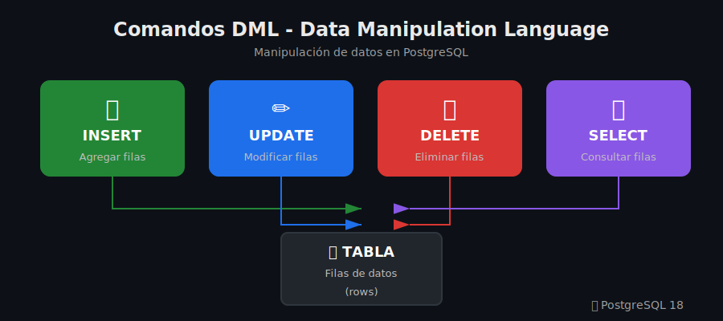
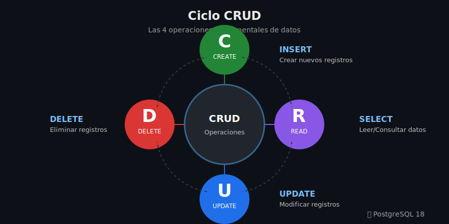

# 📘 Semana 03: DML - Manipulación de Datos

<p align="center">
  
</p>

---

## 🎯 Objetivos de la Semana

Al finalizar esta semana serás capaz de:

- ✅ Insertar datos con INSERT (simple, múltiple, desde SELECT)
- ✅ Actualizar registros con UPDATE y condiciones
- ✅ Eliminar datos con DELETE de forma segura
- ✅ Realizar consultas básicas con SELECT
- ✅ Usar RETURNING para obtener valores insertados/actualizados

---

## 📚 Contenido

| Sección                        | Descripción                           | Tiempo |
| ------------------------------ | ------------------------------------- | :----: |
| [1. Teoría](1-teoria/)         | INSERT, UPDATE, DELETE, SELECT básico |   1h   |
| [2. Práctica](2-practica/)     | Ejercicios guiados paso a paso        |   1h   |
| [3. Ejercicios](3-ejercicios/) | Práctica individual                   |   1h   |
| [4. Proyecto](4-proyecto/)     | Gestión de inventario                 |   1h   |

---

## 🗂️ Estructura de la Semana

```
semana-03/
├── 0-assets/
│   ├── 01-diagrama-dml-comandos.svg
│   ├── 02-diagrama-insert-variantes.svg
│   └── 03-diagrama-crud-ciclo.svg
├── 1-teoria/
│   ├── 01-introduccion-dml.md
│   ├── 02-insert.md
│   ├── 03-update-delete.md
│   └── 04-select-basico.md
├── 2-practica/
│   ├── 01-insertar-datos.md
│   ├── 02-actualizar-eliminar.md
│   └── 03-consultas-basicas.md
├── 3-ejercicios/
│   ├── ejercicios.md
│   └── soluciones.md
├── 4-proyecto/
│   └── proyecto-semana-03.md
├── 5-recursos/
│   └── recursos.md
├── 6-glosario/
│   └── glosario.md
├── README.md
└── rubrica-evaluacion.md
```

---

## 🔑 Conceptos Clave

| Término       | Definición                                   |
| ------------- | -------------------------------------------- |
| **DML**       | Data Manipulation Language - manipular datos |
| **INSERT**    | Agregar nuevas filas a una tabla             |
| **UPDATE**    | Modificar filas existentes                   |
| **DELETE**    | Eliminar filas de una tabla                  |
| **SELECT**    | Consultar y recuperar datos                  |
| **RETURNING** | Obtener valores afectados por la operación   |
| **WHERE**     | Filtrar filas para UPDATE/DELETE/SELECT      |

---

## 🔄 Ciclo CRUD

<p align="center">
  
</p>

| Operación  | SQL      | Descripción                    |
| ---------- | -------- | ------------------------------ |
| **C**reate | `INSERT` | Crear nuevos registros         |
| **R**ead   | `SELECT` | Leer/consultar datos           |
| **U**pdate | `UPDATE` | Modificar registros existentes |
| **D**elete | `DELETE` | Eliminar registros             |

---

## ⏱️ Distribución del Tiempo (4 horas)

```
📚 Teoría      ████████░░░░░░░░ 1h (25%)
💻 Práctica    ████████░░░░░░░░ 1h (25%)
🔧 Ejercicios  ████████░░░░░░░░ 1h (25%)
🚀 Proyecto    ████████░░░░░░░░ 1h (25%)
```

---

## 🚀 Inicio Rápido

### Conectarse a PostgreSQL

```bash
docker exec -it postgres-bootcamp psql -U bootcamp -d tienda_online
```

### Operaciones básicas

```sql
-- Insertar
INSERT INTO productos (nombre, precio) VALUES ('Laptop', 999.99);

-- Consultar
SELECT * FROM productos;

-- Actualizar
UPDATE productos SET precio = 899.99 WHERE nombre = 'Laptop';

-- Eliminar
DELETE FROM productos WHERE nombre = 'Laptop';
```

---

## ✅ Checklist de Progreso

- [ ] Puedo insertar una fila con INSERT
- [ ] Puedo insertar múltiples filas a la vez
- [ ] Sé usar INSERT ... SELECT
- [ ] Puedo actualizar filas con condiciones
- [ ] Sé eliminar filas de forma segura
- [ ] Entiendo la importancia de WHERE en UPDATE/DELETE
- [ ] Puedo usar RETURNING
- [ ] Completé el proyecto semanal

---

## ⚠️ Advertencias Importantes

> 🚨 **UPDATE y DELETE sin WHERE afectan TODAS las filas**
>
> ```sql
> -- ⚠️ PELIGROSO: Actualiza TODOS los productos
> UPDATE productos SET precio = 0;
>
> -- ⚠️ PELIGROSO: Elimina TODOS los productos
> DELETE FROM productos;
>
> -- ✅ SEGURO: Usa siempre WHERE
> UPDATE productos SET precio = 0 WHERE id = 5;
> DELETE FROM productos WHERE id = 5;
> ```

---

## 📖 Navegación

|        ⬅️ Anterior         |          🏠 Inicio          |        Siguiente ➡️        |
| :------------------------: | :-------------------------: | :------------------------: |
| [Semana 02](../semana-02/) | [Bootcamp](../../README.md) | [Semana 04](../semana-04/) |
